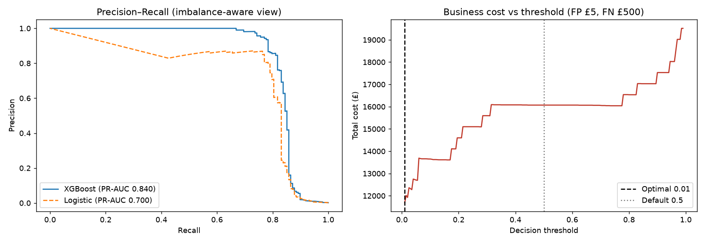
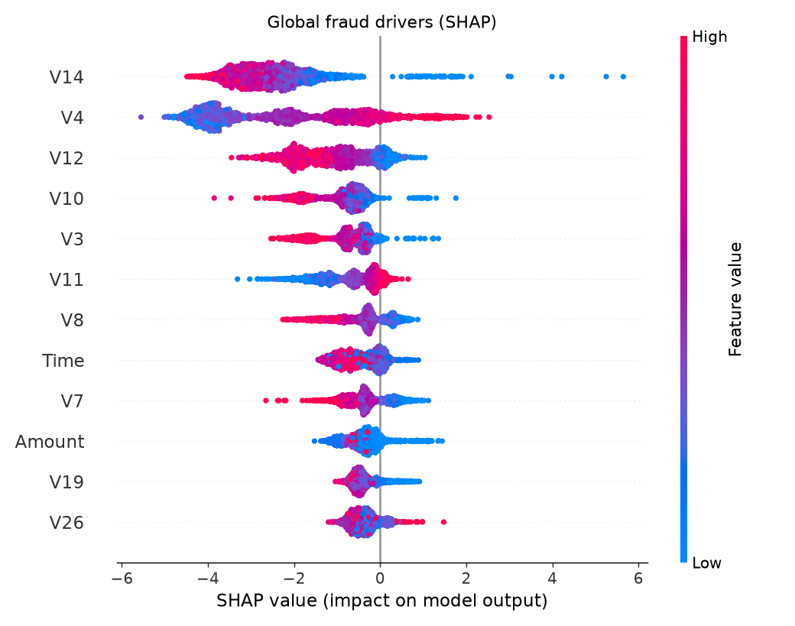

# Cost-Sensitive Credit Card Fraud Detection with Explainable AI

Fraud detection the way a bank actually needs it: built for extreme class imbalance, evaluated on **business cost rather than accuracy**, and explainable at the level of an individual flagged transaction — because in a regulated environment, a model you can't explain is a model you can't deploy.

## The problem

Fraud is ~0.17% of transactions. A model that predicts "never fraud" is 99.8% accurate and completely useless — so this project deliberately avoids accuracy and works with the metrics and trade-offs that fraud teams use:

- **PR-AUC** instead of ROC-AUC as the headline metric (ROC flatters models under extreme imbalance)
- **Asymmetric error costs**: a false positive costs ~£5 (analyst review + customer friction); a false negative costs ~£500 (average written-off fraud loss)
- **Threshold as a business decision**, not a default: the operating point is chosen by minimising total expected cost, not fixed at 0.5

## Results

Real ULB data (284,807 transactions, 0.173% fraud rate):

| Split | Model | PR-AUC | ROC-AUC |
|---|---|---|---|
| Random (stratified 70/30) | Logistic regression (class-weighted) | 0.700 | 0.968 |
| Random (stratified 70/30) | **XGBoost** (scale_pos_weight) | **0.840** | 0.973 |
| Time-based (first 70% / last 30%) | Logistic regression (class-weighted) | 0.770 | 0.980 |
| Time-based (first 70% / last 30%) | **XGBoost** (scale_pos_weight) | **0.805** | 0.983 |

On the random split, ROC-AUC is nearly identical between models (0.968 vs. 0.973) while PR-AUC separates them clearly (0.700 vs. 0.840) — exactly why PR-AUC is the right lens under this level of imbalance.



**Cost-based thresholding:** on the random split, moving XGBoost's decision threshold from the default 0.5 to the cost-optimal **0.01** cuts total cost on the test window from **£16,070** (14 FPs, 32 missed frauds) to **£11,690** (138 FPs, 22 missed frauds) — a **27% reduction**. The optimal threshold sits this low precisely because a missed fraud costs 100× a false alarm, so it's cheap to accept many more false positives in exchange for catching a few more frauds.

**Explainability:** SHAP provides (1) a global view of which features drive fraud predictions and (2) a per-transaction waterfall showing exactly why a specific transaction was flagged — the artefact a model-risk committee or a customer-disputes team would ask for.



**Random vs. time-based split:** `train.py` evaluates both a stratified random split and a chronological split (train on the first 70% of transactions by `Time`, test on the last 30% — the split that best simulates real deployment, since it never lets the model see transactions from "the future"). A side-by-side comparison chart is saved to `outputs/04_split_comparison.png`.

| Metric | Random split | Time-based split |
|---|---|---|
| XGBoost PR-AUC | 0.840 | 0.805 |
| XGBoost ROC-AUC | 0.973 | 0.983 |
| Cost-optimal threshold | 0.01 | 0.01 |
| Cost at optimal threshold | £11,690 | £11,070 |
| Cost at default 0.5 threshold | £16,070 | £13,065 |

*Why they differ, honestly:* the time-based test window (the last 30% of transactions chronologically) happens to have a lower fraud rate than the random split's test set (0.126% vs. 0.173%), and the ULB dataset only spans two days — so with relatively few fraud cases in either tail, part of the PR-AUC gap is sampling noise, not necessarily a signal of concept drift. What the comparison *does* show reliably: the two protocols disagree on which metric looks better (PR-AUC favours the random split, ROC-AUC favours the time split), which is itself the point — a single split and a single metric can quietly mislead you about production performance, and the time-based protocol is the one that can't cheat by letting future transactions leak into training.

## Data

Built for the [ULB Credit Card Fraud dataset](https://www.kaggle.com/datasets/mlg-ulb/creditcardfraud) (284,807 real anonymised transactions, PCA-transformed features). Download `creditcard.csv` into `data/` and the pipeline uses it automatically. A synthetic fallback generator (`make_synthetic_data.py`) with the same schema and fraud rate is included so the pipeline runs end-to-end without the download.

## Structure & usage

```
├── src/
│   ├── make_synthetic_data.py   # schema-matched fallback data
│   └── train.py                 # full pipeline: models, cost tuning, SHAP
├── outputs/                     # PR/cost curves, SHAP summary, single-case waterfall
└── data/                        # place creditcard.csv here (gitignored)
```

```bash
pip install pandas numpy scikit-learn xgboost shap matplotlib
python src/make_synthetic_data.py     # skip if you downloaded the real data
python src/train.py
```

## What I'd do next

- Precision@k evaluation to match a fixed analyst review capacity
- Calibration of predicted probabilities before cost optimisation
- A champion/challenger monitoring design for post-deployment drift

## Skills demonstrated

Imbalanced classification · XGBoost & scikit-learn · cost-sensitive decision thresholds · PR-AUC evaluation · SHAP explainability (global + local) · framing ML in regulatory/business terms.

## License

MIT — see [LICENSE](LICENSE).

---
*Akshay Shelke — MSc Data Science (Merit), Coventry University · [LinkedIn] · [Email](mailto:akshayraj2895@gmail.com)*
